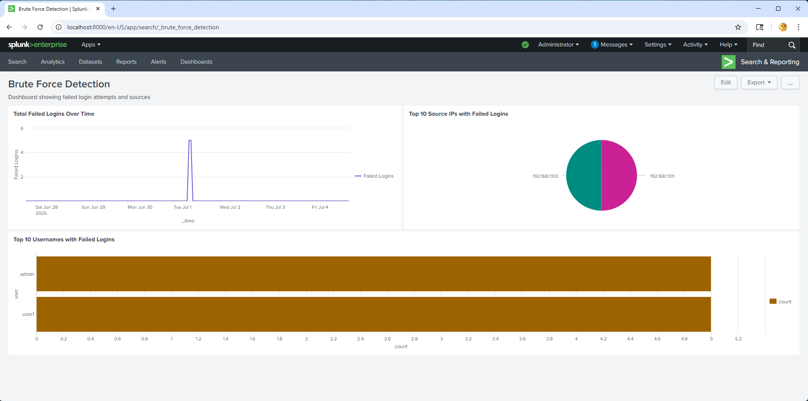
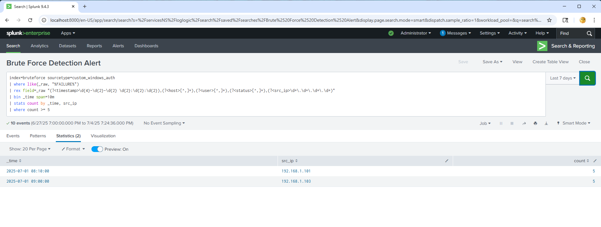

# Brute Force Detection & Alerting in Splunk

This project demonstrates a real-world brute force login detection use case using Splunk. It includes log ingestion, search logic, visualization through dashboards, and a triggered alert when failed login attempts exceed a defined threshold.

---

## Project Overview

**Goal:**  
Detect repeated failed login attempts that may indicate a brute force attack. Visualize the behavior over time and trigger an alert when suspicious patterns are observed.

**Data:**  
Custom `windows_auth.log` file containing login activity logs with fields:  
`timestamp, hostname, username, status, source IP`

**Tool:**  
Splunk Enterprise (local)

---

## Tools & Features Used

- Splunk Search & Reporting
- Custom sourcetype (`custom_windows_auth`)
- Custom index (`bruteforce`)
- SPL (Search Processing Language)
- Dashboards (Classic)
- Scheduled alert
- Custom regex field extractions
- Visualization panels (line, pie, bar)

---

## Detection Logic Summary

1. **Filter** failed login events by searching for "FAILURE"
2. **Extract** usernames and source IPs using `rex`
3. **Count** and **group** failed attempts over time
4. **Alert** when 5+ failures from the same IP occur within a 10-minute window

---

## Dashboard Panels

1. **Total Failed Logins Over Time**  
   *Line chart showing failed login activity hourly*

2. **Top 10 Source IPs with Failed Logins**  
   *Pie chart identifying IPs with the most failed login attempts*

3. **Top 10 Usernames with Failed Logins**  
   *Bar chart of usernames with the most failed logins*

  
_Example: Full view of all 3 panels displayed in the Classic Dashboard_

---

## Brute Force Alert Configuration

- **Schedule:** Every 10 minutes (Cron: `*/10 * * * *`)
- **Search Time Range:** Last 7 days
- **Condition:** Trigger if 5+ failed login attempts from a single IP
- **Trigger Type:** For each result
- **Action:** Add to Triggered Alerts

  
_Example: Screenshot from Triggered Alerts showing a fired alert event_

---

## Key SPL Queries

### 1. Total Failed Logins Over Time

index=bruteforce sourcetype=custom_windows_auth

| where like(_raw, "%FAILURE%")

| timechart span=1h count as "Failed Logins"

## 2. Top 10 Source IPs with Failed Logins

index=bruteforce sourcetype=custom_windows_auth

| where like(_raw, "%FAILURE%")

| rex field=_raw "(?<src_ip>\d+\.\d+\.\d+\.\d+)"

| stats count by src_ip

| sort -count

| head 10

## 3. Top 10 Usernames with Failed Logins

index=bruteforce sourcetype=custom_windows_auth

| where like(_raw, "%FAILURE%")

| rex field=_raw "(?<user>[^,]+),(?<status>FAILURE)"

| stats count by user

| sort -count

| head 10

## 4. Alert SPL - Brute Force Detection

index=bruteforce sourcetype=custom_windows_auth

| where like(_raw, "%FAILURE%")

| rex field=_raw "(?<timestamp>\d{4}-\d{2}-\d{2} \d{2}:\d{2}:\d{2}),(?<host>[^,]+),(?<user>[^,]+),(?<status>[^,]+),(?<src_ip>\d+\.\d+\.\d+\.\d+)"

| bin _time span=10m

| stats count by _time, src_ip

| where count >= 5

---

### Alert Investigation Report:

This project also includes a simulated SOC-style alert triage write-up based on a triggered brute force detection.

[→ View Alert Report](https://github.com/LogLogic/SIEMDashboardsDetectionEngineering/blob/main/BruteForceDetectionSplunk/investigations/alert-report_bruteforce-192.168.1.103.md)
