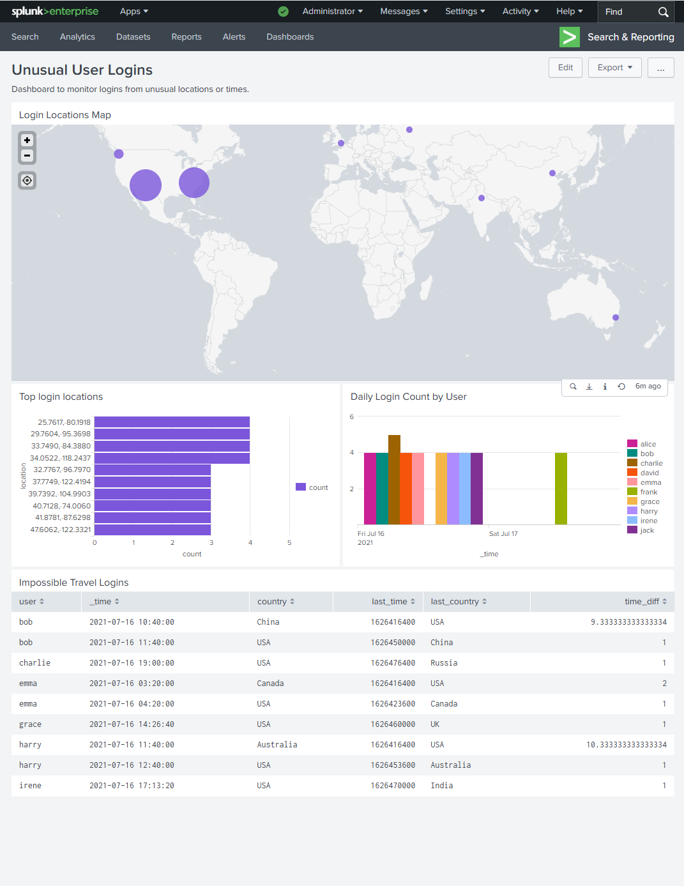

# Detecting Unusual User Logins in Splunk

This project demonstrates how to identify suspicious user login activity using Splunk. It focuses on detecting logins from unusual locations (e.g., foreign countries) and unusual times to highlight potential security concerns. The project includes log ingestion, detection logic, dashboards for visualization, and an investigation-style triage report. Note that no automated alerting has been configured in this project.

---

## Project Overview

**Goal:**  
Detect unusual login activity by analyzing geographic locations and login times. Identify suspicious logins from unexpected countries or rapid logins from distant locations that may indicate account compromise.

**Data:**  
Custom `sample_login_data.csv` file containing user login events with fields:  
`_time (epoch), user, src_ip, city, country, lat, lon`

**Tool:**  
Splunk Enterprise (local)

---

## Tools & Features Used

- Splunk Search & Reporting  
- Custom sourcetype (`sample_login_data`)  
- Custom index (`login_data`)  
- SPL (Search Processing Language) for multi-country, off-hours, new IP, and impossible travel detection  
- Dashboards (Classic) with map, bar chart, timechart, and table panels  
- Field extractions and eval functions for time and geolocation processing  
- Streamstats and sorting for sequential event analysis  

---

## Detection Logic Summary
**Login Type:** 
*Focus only on success login events*

**Evaluate:**
*Logins occurring outside typical business hours (before 6 AM or after 10 PM UTC)*

*Logins from multiple countries for the same user within a short timeframe*

*Logins from new or previously unseen IP addresses in the last 24 hours*

*Impossible travel scenarios where geographically distant logins occur within a short time window (less than 12 hours)*

**Identify as suspicious:**
*Any login that violates either condition*

---

## Dashboard Panels

1. **Login Locations Map**
   *Visualizes login counts by geographic coordinates (latitude and longitude) on a map.*

2. **Top login locations**
*Bar chart showing the top 10 most frequent login locations aggregated by latitude and longitude.*

3. **Daily Login Count by User**
*Bar chart displaying daily login counts grouped by user, highlighting spikes in activity.*

4 **Impossible Travel Logins**
*Table listing users with rapid logins from geographically distant locations within a short time window, indicating potential suspicious activity.*

  
_Example: Full view of all 4 panels displayed in the Classic Dashboard_

---

## Key SPL Queries Used for the Search

### 1. Multi country logins
```
index=login_data
| stats dc(country) as country_count by user
| where country_count > 1
```

### 2. Unusual hours logins
```
index=login_data
| eval hour=strftime(_time, "%H")
| where hour < 6 OR hour > 22
| stats count by user, hour, city, src_ip
```

### 3. New IPs in the 24 hours
```
index=login_data
| stats earliest(_time) as first_seen by user, src_ip
| where first_seen >= relative_time(strptime("2021-07-17", "%Y-%m-%d"), "-1d@d")
| eval first_seen_date=strftime(first_seen, "%Y-%m-%d %H:%M:%S")
| table user, src_ip, first_seen_date
```

### 4. Impossible travel
```
index=login_data
| sort 0 user _time
| streamstats current=f last(_time) as last_time last(country) as last_country by user
| eval time_diff = (_time - last_time) / 3600
| where last_country != country AND time_diff < 12
| table user, _time, country, last_time, last_country, time_diff
```

## Key SPL Queries Used for Dashboard Panels

### 1. Login Locations Map
```
index=login_data
| where isnotnull(lat) AND isnotnull(lon)
| geostats latfield=lat longfield=lon count
```

### 2. Top Login Locations
```
index=login_data
| where isnotnull(lat) AND isnotnull(lon)
| eval Location=lat . "," . lon
| stats count by Location
| sort -count
| head 10
```

### 3. Daily Login Count by User
```
index=login_data
| timechart span=1d count BY user
```

### 4. Impossible Travel Logins
```
index=login_data
| sort 0 user _time
| streamstats current=f last(_time) as last_time last(country) as last_country by user
| eval time_diff = (_time - last_time) / 3600
| where last_country != country AND time_diff < 12
| table user, _time, country, last_time, last_country, time_diff
```
---

## Investigation Report

This project includes a simulated SOC-style investigation write-up. The report walks through triage steps, context gathering, and recommended next actions.

[→ View Investigation Report](https://github.com/LogLogic/SIEMDashboardsDetectionEngineering/blob/main/DetectingUnusualUserLoginsSplunk/investigations/unusual_logins_report.md)
