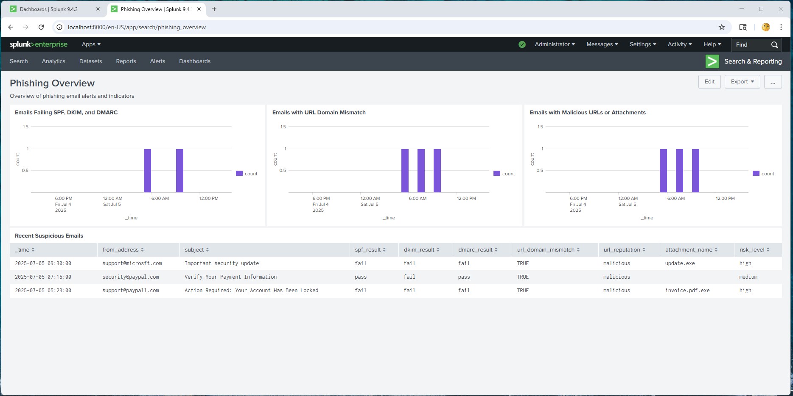
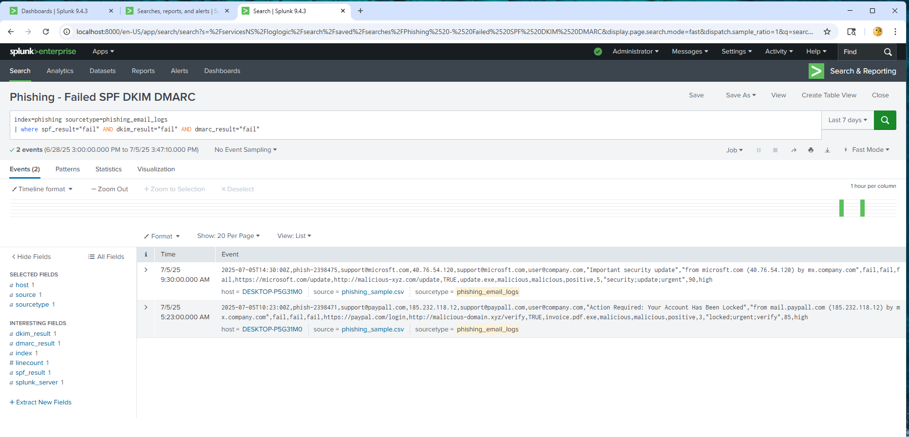

# Phishing Email Analysis Automation in Splunk

This project demonstrates automated phishing email detection using Splunk. It includes ingestion of phishing email logs, detection rules, scheduled alerts, and a dashboard for monitoring phishing indicators in a SOC environment.

---

## Project Overview

**Goal:**  
Detect phishing emails by analyzing email authentication results, URL mismatches, and malicious indicators. Visualize trends and trigger alerts to enable rapid SOC response.

**Data:**  
Simulated phishing email logs in CSV format with fields such as:  
`timestamp, from_address, subject, spf_result, dkim_result, dmarc_result, url_domain_mismatch, url_reputation, attachment_name, attachment_hash_vt, risk_level`

**Tool:**  
Splunk Enterprise (local)

---

## Tools & Features Used

- Splunk Search & Reporting  
- Custom sourcetype (`phishing_email_logs`)  
- Custom index (`phishing`)  
- SPL (Search Processing Language)  
- Scheduled alerts  
- Classic dashboards  
- Visualization panels (bar charts, tables)  

---

## Detection Logic Summary

1. Identify emails failing SPF, DKIM, and DMARC authentication checks  
2. Detect URL domain mismatches between display and actual URLs  
3. Flag malicious URLs, IPs, and attachments based on reputation and VirusTotal hashes  
4. Trigger alerts for each phishing indicator category  

---

## Dashboard Panels

## Dashboard Panels

1. **Emails Failing SPF, DKIM, and DMARC**  
   *Bar chart showing phishing emails failing all authentication checks over time*

2. **Emails with URL Domain Mismatch**  
   *Bar chart highlighting emails where displayed and actual URLs differ*

3. **Emails with Malicious URLs or Attachments**  
   *Bar chart tracking emails containing malicious URLs, IPs, or attachments*

4. **Recent Suspicious Emails**  
   *Table listing recent phishing emails with key fields for quick triage*

  
_Example: Full view of all 4 panels displayed in the Classic Dashboard_

---

## Alerts Configuration

- **SPF/DKIM/DMARC Fail Alert**  
  Schedule: Every 15 minutes (Cron: `*/15 * * * *`)  
  Condition: Trigger if any emails fail all three authentication checks  
  Trigger Type: Once per search  
  Action: Send email or add to Triggered Alerts

- **URL Domain Mismatch Alert**  
  Schedule: Every 15 minutes (Cron: `*/15 * * * *`)  
  Condition: Trigger if emails with URL domain mismatches detected  
  Trigger Type: Once per search  
  Action: Send email or add to Triggered Alerts

- **Malicious Indicators Alert**  
  Schedule: Every 15 minutes (Cron: `*/15 * * * *`)  
  Condition: Trigger if emails contain malicious URLs, IPs, or attachments  
  Trigger Type: Once per search  
  Action: Send email or add to Triggered Alerts

  
_Example: Screenshot from Triggered Alerts showing a fired alert event_  

---

## Key SPL Queries

**Emails failing all auth checks:**  

index=phishing sourcetype=phishing_email_logs

| where spf_result="fail" AND dkim_result="fail" AND dmarc_result="fail"

**Emails with URL domain mismatch:**

index=phishing sourcetype=phishing_email_logs

| where url_domain_mismatch="TRUE"

**Emails with malicious URLs or attachments:**

index=phishing sourcetype=phishing_email_logs

| where url_reputation="malicious" OR ip_reputation="malicious" OR attachment_hash_vt="positive"

---

### Alert Investigation Report

This project includes a simulated SOC-style alert triage report based on triggered phishing email alerts.

[→ View Alert Report](https://github.com/LogLogic/SIEMDashboardsDetectionEngineering/blob/main/PhishingEmailAnalysisSplunk/investigations/alert-investigation_phishing_failed-auth_20250705.md)  

